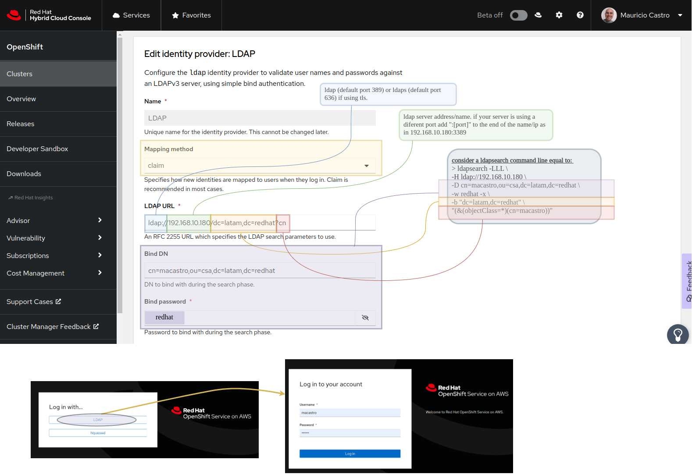
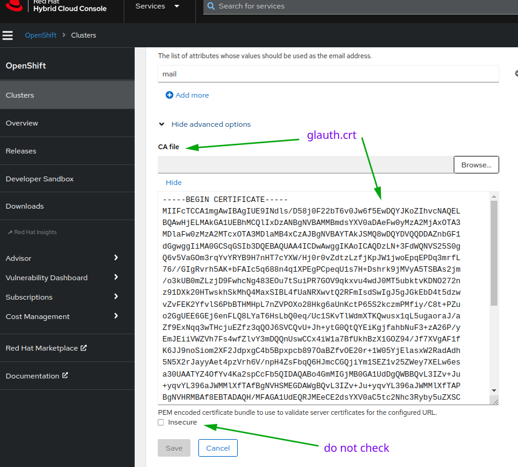

# The case of the impossible additional users
## Abstract and Motivation
Working in a engagemt for a [OSD non CCS in GCP](https://docs.openshift.com/dedicated/osd_planning/gcp-ccs.html) I found myself caught in a strange situation. While helping the dedicated engineer working with the cluster he posed to me the issue: "I need to create new users in the cluster, but there's no IDP yet defined by the client", meaning from [all the many possible IDPs managed Openshift](https://docs.openshift.com/container-platform/4.13/authentication/index.html) can use the only one in place was htpasswd and the one user possible was already taken, the one he was operating with. Yes, htpasswd IDP in a managed Openshift can only have one user defined. 

The motivation for this blog is exactly that. Extra users were needed temporarily and if possible with logins the same as their future logins would be. The future IDP coming was LDAP. 

At the time I offered him, in my humble opinion, what would be two of the most quick (and almost dirty) solutions from the top of my head, I said "ok, create a good old user that will authenticate with a good old kubernetes client certificate and/or setup a temporary LDAP server and use the LDAP IDP". 

What seemed to me at the time a fast and easy solution was not in fact so automatic to pull off the hat, so I decided to put together all the scripting, code, actions, steps taken to make it not only possible, but also simple in this blog + code post.

## Authenticate with a user certificate
[This solution is part of Red Hat's solution knowledge base](https://access.redhat.com/solutions/5360261) and can also be found in [Kubernetes official documentation](https://kubernetes.io/docs/reference/access-authn-authz/certificate-signing-requests/#normal-user). With this, all you need to do is follow those instructions or clone the blog repo and run the [create-cert-user](cert/create-cert-user.sh) script ([yq](https://github.com/mikefarah/yq/releases) is needed to run it). You'll need to be logged as administrator into the cluster you are currently targeting.

:bulb: The knowledge base procedure considers your kube config first cluster entry is the cluster you want when creating the new context. If you work with many clusters at once this may not be true for you, please check you kube config with 
```
oc config get-clusters
```
```bash\
# from repo base directory
cd redhat/idp/cert+ldap/cert
./create-cert-user.sh newuser
```
In case you don't want to clone the repo here's the script:
```bash
cfg="$HOME/.kube/config"
export usr=$1
export cluster=`oc config get-contexts | grep '^*' | awk '{print $3}'`
export ctx="$usr@$cluster"
current_ctx=`oc config current-context`

openssl req -new -newkey rsa:2048 -nodes -keyout $usr.key -out $usr.csr -subj "/CN=$usr"
oc create user $usr

cat <<EOF | oc apply -f -
apiVersion: certificates.k8s.io/v1
kind: CertificateSigningRequest
metadata:
  name: $usr
spec:
  request: `cat $usr.csr | base64 -w 0`
  signerName: kubernetes.io/kube-apiserver-client
  expirationSeconds: 31536000
  usages:
  - client auth
EOF

sleep 1
oc adm certificate approve $usr
sleep 3
oc get csr $usr -o jsonpath='{.status.certificate}' | base64 -d > $usr.crt
oc config set-credentials $usr --client-certificate=$usr.crt --client-key=$usr.key --embed-certs=true
oc config set-context "$ctx" --namespace=default --cluster=$cluster --user=$usr
oc config use-context "$ctx" 
oc whoami
oc config use-context "$current_ctx" 


# extract the context recently created to share with created user owner
cat <<EOF | yq > $usr.cfg
apiVersion: v1
kind: Config
preferences: {}
current-context: $ctx
clusters: 
- 
`yq '.clusters[] | select(.name == strenv(cluster))' $cfg | sed -e 's/^/  /g'`
users:
- 
`yq '.users [] | select(.name == strenv(usr))' $cfg | sed -e 's/^/  /g'`
contexts:
-
`yq '.contexts [] | select(.name == strenv(ctx))' $cfg | sed -e 's/^/  /g'`
EOF
```
:point_up: The file named *'newuser.cfg'* from the above script should be a valid kube config file that can be shared with the newly created user.

:point_right: Remember to bind a role to the new user.

 > :heavy_exclamation_mark: Attention to the fact that the users' private keys will be lying around and embedded in the kube config :heavy_exclamation_mark:

## Authenticate with a LDAP deployed in the cluster
With LDAP as the second quick and almost dirty solution to rapidly create users for the cluster I needed a simple, no-thrills LDAP server to run and I found [Glauth](https://glauth.github.io) which is tested, neat and has a different number of backend choices for the user database including simple text config in TOML, which we're using below.

In the repo you'll find a [deployment manifest](ldap/deployment.yaml) with everything, but first you need to generate the key and certificate for the secure port of the LDAP server and update the *'ConfigMap'* in the deployment file with both. If you generate the certificate and key with different names than the example below bare in mind [the IDP configuration step](#configure-an-ldap-idp) will need to be modified accordingly.
```
openssl genrsa -out glauth.key 2048
openssl req -new -x509 -sha256 -key glauth.key -out glauth.crt -subj "/CN=glauth" -days 3650 -addext "subjectAltName=DNS:glauth.glauth.svc.cluster.local, DNS:glauth.ddns.net, DNS:glauth.duckdns.org, DNS:glauth.mscastro.net"
```

If you are planning on [exposing the service to the outside of the cluster](#exposing-your-internal-ldap) you need to add the DNS names you intend using to *'subjectAltName'* when generating the certificate. Also, if for any extraordinary reason you are not using the default domain name of a kubernetes cluster, you also need to adjust *'glauth.glauth.svc.cluster.local'* to your needs.

If you have [yq](https://github.com/mikefarah/yq/releases) installed you can run the [create-cert-and-deploy](ldap/create-cert-and-deploy.sh) script from the repo to accomplish all of the above in one go, see it below
```bash\
# from repo base directory
cd redhat/idp/cert+ldap/ldap
./create-cert-and-deploy.sh
```
```bash
dns_names="glauth.glauth.svc.cluster.local glauth.ddns.net glauth.duckdns.org glauth.mscastro.net"
subj_alt_name="subjectAltName=DNS:`echo $dns_names | sed -e 's/ /,DNS:/g'`"

openssl genrsa -out glauth.key 2048
openssl req -new -x509 -sha256 -key glauth.key -out glauth.crt -subj "/CN=glauth" -days 3650 -addext "$subj_alt_name"
yq 'select(.kind=="ConfigMap" and .metadata.name=="glauth") ref $x | $x.data."glauth.key" = load_str("glauth.key") | $x.data."glauth.crt" = load_str("glauth.crt")' deployment.yaml | oc apply -f -
```

If you did not use the above script, of course you need to run `oc apply -f deployment.yaml` before moving on.

Let's use a image container with ldapsearch and test it from inside the cluster:
```
oc debug --image=emeraldsquad/ldapsearch
ldapsearch -v -LLL -H ldap://glauth.glauth.svc.cluster.local -D cn=redhat,ou=csa,dc=latam,dc=redhat -w redhat -x -b "dc=latam,dc=redhat" cn=hi
```
The above search should return information about user named *'hi'*. If you want to test the secure port 636, export `LDAPTLS_REQCERT=never` and redo the search with `ldaps://`.

### Configure an LDAP IDP
#### Configure using OCM WEB UI
Now, it's all about adding a new LDAP IDP using the [OCM web UI ](https://console.redhat.com/openshift) like below 



> LDAP URL: ldaps://glauth.glauth.svc.cluster.local/dc=latam,dc=redhat?cn

:point_right: and make sure to add glauth.crt



#### Configure using the terminal and oc CLI
The other way you can configure is following the [Openshift documentation for adding a new LDAP IDP](https://docs.openshift.com/container-platform/4.13/authentication/identity_providers/configuring-ldap-identity-provider.html) while using the CLI or using the [script provided in the repo](ldap/add-ldap-idp.sh) and below
```bash
# from repo base directory
cd redhat/idp/cert+ldap/cert/ldap
./add-ldap-idp.sh
```
```bash
type="private"
ldap_host="glauth.glauth.svc.cluster.local"
bind_dn="cn=redhat,ou=csa,dc=latam,dc=redhat"
bind_pwd="redhat" # change the passwd according to the bindDN used
crt_file=glauth.crt
ldap_searchbase="dc=latam,dc=redhat"
ldap_filter="cn"
ldap_url="ldaps://$ldap_host/$ldap_searchbase?$ldap_filter"
secret_name="glauth-bind-passwd"
config_map_name="glauth-cert-$type"
export patch_file="/tmp/ldap-idp-$type.yaml"
export idp_name="ldap-$type"

oc delete secret $secret_name -n openshift-config --ignore-not-found
oc delete configmap $config_map_name -n openshift-config --ignore-not-found
oc create secret generic $secret_name --from-literal=bindPassword="$bind_pwd" -n openshift-config 
oc create configmap $config_map_name --from-file=ca.crt=$crt_file -n openshift-config

cat <<EOF > $patch_file
- ldap:
    attributes:
      email:
        - mail
      id:
        - dn
      name:
        - cn
      preferredUsername:
        - uid
    bindDN: $bind_dn
    bindPassword:
      name: $secret_name
    ca:
      name: $config_map_name
    insecure: false
    url: $ldap_url
  mappingMethod: claim
  name: $idp_name
  type: LDAP
EOF

echo -n "removing $idp_name... "
oc get oauth cluster -o yaml | yq 'del(.spec.identityProviders[] | select(.name == strenv(idp_name)))' | oc apply -f -
echo -n "adding $idp_name... "
oc get oauth cluster -o yaml | yq '.spec.identityProviders += load(strenv(patch_file))' | oc apply -f -
rm $patch_file
```
:point_up: Above script adds a *'type'* suffix to the ldap idp config in Openshift oauth. If you plan to [expose it](#exposing-your-internal-ldap) and want to test the exposed version, add a new one pointing to the outside version, change the suffix and the *'ldap_host'*.
### Adding new users
If you looked at the [configmap](ldap/deployment.yaml) you easily spotted how you´d add more users. Just go about repeating the block below and change the fields, mandatorily *'name'*. The password is the sha256 of the clear text.


### Exposing your internal LDAP 
You can expose your recently added LDAP server by running
```
oc project glauth
oc expose deployment glauth --name='glauth-public-exposed'  --target-port='3636' --port='636' --type='LoadBalancer'
```
That will add a load balancer to the cluster. If you need it to be deployed with a private IP add the [custom annotation for your cloud provider](https://kubernetes.io/docs/concepts/services-networking/service/#internal-load-balancer)
```yaml
apiVersion: v1
kind: Service
metadata:
  name: glauth-private-exposed
  namespace: glauth
  annotations:
    # GCP 
    # networking.gke.io/load-balancer-type: "Internal" 
    # AWS
    # service.beta.kubernetes.io/aws-load-balancer-internal: "true" 
    # AZR
    # service.beta.kubernetes.io/azure-load-balancer-internal: "true"
spec:
  type: LoadBalancer
  ports:
    - name: sldap
      port: 636
      targetPort: 3636
      protocol: TCP
  selector:
    app: glauth
```
Once you know the load balancer IP `oc get svc glauth-public-exposed -n glauth -o jsonpath='{.status.loadBalancer.ingress[0].hostname}'` you can add an entry to your DNS server pointing to it, but remember that the name you use needs to be in the certificate DNS names list of the glauth.crt certificate file created before.

#### About sharing the load balancer for other Services in the cluster
Yes, this is the case where an ingress won't do because we're talking about ports different than 80 and 443 and managed Openshift does not provide this easily, the best, fastest, simplest way I could find to get this going is using the NGINX Ingress Controller, which can be deployed using the operators hub and requires some configuration tricks to work, but that is a story for a different blog post...


